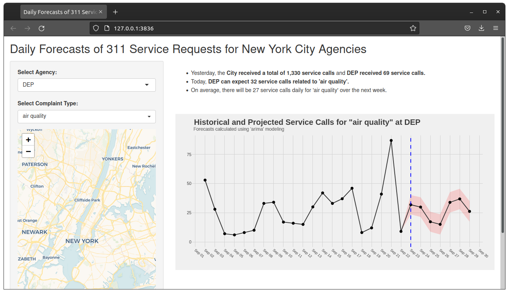

# Forecasting 311 calls

Forecasting daily 311 call volume by agency and complaint types

### Folder structure
    .
    ├── 311_calls         # Shiny app
    ├── analysis          # Analysis scripts
    │   ├── backtest      # Time-series cross validation
    │   └── plots         # Generated plots
    ├── data              # Cleaned data, cleaning scripts, daily scripts
    ├── discard           # Deprecated scripts
    ├── inputs            # Raw input data
    └── README.md
    
### Modeling process

Forecast models are selected independently for each agency and complaint type. There are seven candidate time-series model families and each are evaluated via time-series cross validation using RMSE. The seven models are mean, naive, seasonal naive, drift, exponential smoothing, ARIMA, and Prophet. ARIMA model selected via stepwise process. Exogenous variables include holidays, temperature, precipitation, and wind. 

